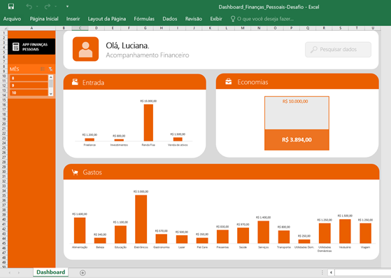

# create-dashboard-with-excel
> Academic Project for Open Education Platform DIO 

DASHBOARD DE FINANÇAS PESSOAIS COM MICROSOFT EXCEL

# Projeto: Como Organizar suas Finanças com Planilhas Inteligentes e IA

 > 🗒️ **SOBRE:** Este é o repositório desenvolvido durante o Bootcamp promovido pela plataforma da [DIO](https://dio.me) em parceria com a Caixa Econômica Federal e a Microsoft. Projeto com o objetivo de aprofundar os conhecimentos sobre a ferramenta Excel através da elaboração de gráficos, tabelas dinâmicas e um Dashboard funcional, bem como explorar e aprimorar o uso das plataformas de Inteligência Artificial disponíveis através da sua utilizazação do ChatGPT para interpretação de dados financeiros. 

<a href="https://github.com/lsnakata/create-dashboard-with-excel/blob/main/Dashboard_Finan%C3%A7as_Pessoais-Desafio.xlsx" title="View Tabs Now"> 📊 Dashboard disponível para download aqui</a>

<a href="https://github.com/lsnakata/create-dashboard-with-excel/blob/main/Output_ChatGPT_Finan%C3%A7as_Pessoais-Desafio.pdf" title="View PDF Now"> 📕 Análise do ChatGPT disponível para leitura aqui</a>

## 🖋️ Ferramentas Utilizadas no Projeto

- [Excel](https://www.microsoft.com/pt-br/microsoft-365/excel)
- [ChatGPT](https://chat.openai.com/)
 

## 🖥️ Desenvolvimento 

Foi disponibilizado ao aluno o arquivo de dados base. Esses foram organizados em tabelas dinâmicas com filtros adequados ao projeto na ferramenta Excel. A partir dessas tabelas foram extraídos os gráficos que compuseram o conteúdo visual necessário para a aba principal de Dashboard com informações relevantes, como por exemplo, as principais categorias dos "Gastos" do usuário. A aba de Dashboard foi aperfeiçoada para apresentar o conteúdo de maneira mais simples, objetiva e organizada e a ela foi adicionado um filtro aos gráficos para que o usuário possa visualizar suas finanças mês à mês. Após a conclusão do produto final ocorreu a etapa de utilização da Inteligência Artificial através do uso do ChatGPT para análise dos dados revelando diversas possibilidades disponíveis nessa tecnologia. 
Segue abaixo Prompt utilizado.

## 🗨️ Prompts

ChatGPT：

|  Objetivo   | Prompt                                                                                                                                                                                                                                                                                                                      |
|  :------:   | --------------------------------------------------------------------------------------------------------------------------------------------------------------------------------------------------------------------------------------------------------------------------------------------------------------------------- |
|  Insights   | Utilize a tabela de dados contida no documento acima (o arquivo da base de dados foi enviada no chat junto com o prompt) como base de conhecimento e gere alguns insights dessa tabela de gastos {REGRAS} >Você é um Consultor de Finanças Pessoais >Identifique quais são os meus maiores Gastos >Apresente um Resumo Financeiro com os Totais das Entradas e das Saídas                                                                                                                            |

## ✨ Features

- Dashboard de Finanças Pessoais desenvolvido em Excel
- Análise de Finanças Pessoais gerada em ChatGPT
 

## 📚 Materiais

- Base de Dados disponível em `inventory`
- Dashboard disponível em `main`
- Output ChatGPT disponível em `main`

## 👨‍💻 Autoria

Luciana Nakata
 
 <a href="www.linkedin.com/in/luciana-nakata-43397b86">LinkedIn</a> 

&nbsp;
